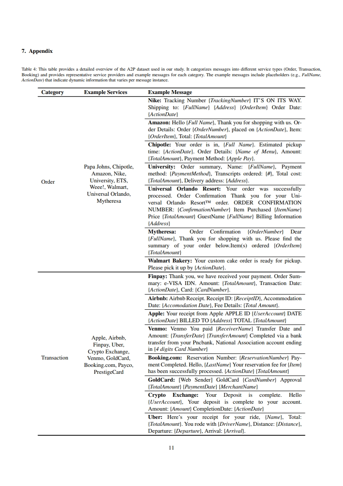
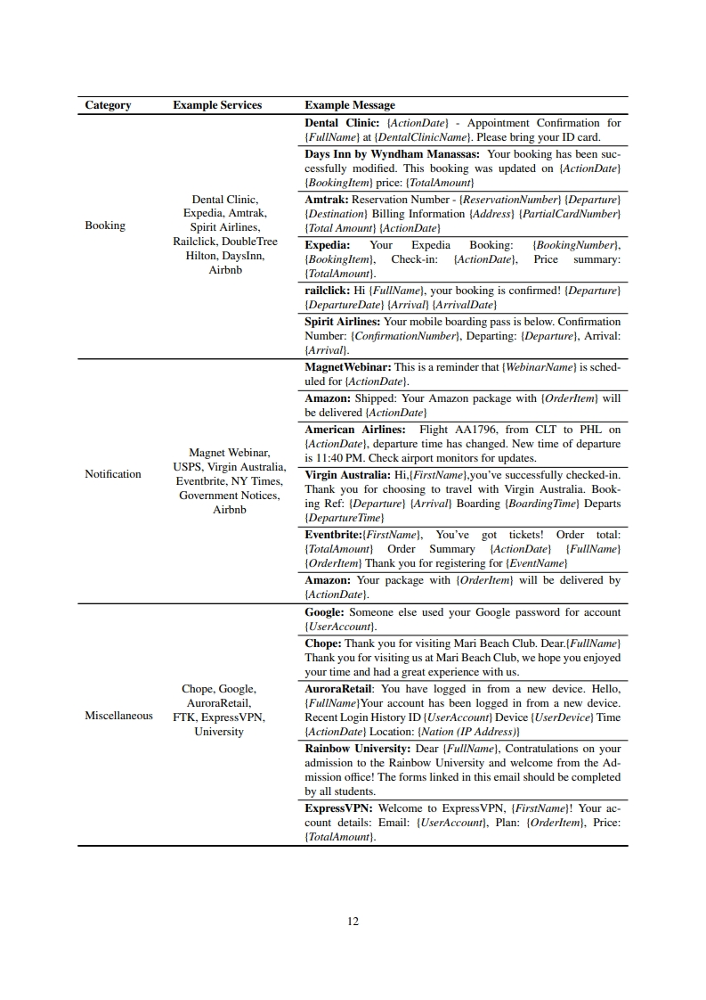

# [DFRWS USA 2025] SERENA (Systematic Extraction and Reconstruction for ENhanced A2P Message Forensics)

📄 **Official repository for our research paper submitted to DFRWS 2025 USA**
SERENA (Systematic Extraction and Reconstruction for Enhanced A2P Message Forensics) is a forensic tool designed to automate the **extraction, classification, and highlighting** of structured data from **Application-to-Person (A2P) messages**. The tool leverages **GPT-4o** to classify A2P messages and extract key forensic information, enabling investigators to efficiently analyze digital communications.

## 📌 Key Features
- **Automated Data Processing**: Converts emails (.eml), text messages (.xlsx), and chat logs into structured text format.
- **A2P vs. P2P Classification**: Identifies and categorizes messages using OpenAI’s GPT-4o.
- **Named Entity Recognition**: Extracts essential forensic data (e.g., service name, timestamps, payment details).
- **GUI-Based Analysis**: Provides an interactive interface for forensic investigators.
- **Highlighting Feature**: Displays extracted keywords directly within the original message.

## 📂 Repository Structure

- **`data_preprocessing.py`, `preprocess.py`**  
  - Converts emails (.eml), text messages (.xlsx), and chat logs into structured text format.

- **`A2P_classifying.py`**  
  - Classifies messages as A2P (Application-to-Person) or P2P (Person-to-Person) using GPT-4o.

- **`named_entity_recognition.py`**  
  - Extracts structured data such as service name, timestamp, payment amount, etc.
  - Normalize values (e.g., datetime - YYYY/MM/DD hh:mm:ss, amount - USD 150, AUD 300)

- **`SERENA-GUI.py`**  
  - Provides a GUI-based interface for forensic investigation.
 
- **`SAMPLE A2P DATASET`**
  - Provides real-world A2P messages (emls and chat logs).
  - Service names, addresses, numbers, and other identifiable information have been redacted.
  - 
- **`requirements.txt`**  
  - Lists required Python dependencies for the project.

- **`README.md`**  
  - This README file containing project details and setup instructions.
 

## 📌 How to Run the Tool on a Git Repository
To ensure the tool works correctly, the selected folder must contain the following subfolders:

- **`📂 emls/ (For processing email data)`** 
- **`📂 messagingapp/ (For chat and messaging app logs)`** 
- **`📂 textmessage/ (For SMS and text message logs)`**

- Once the base folder is selected, the **A2P classification** and **Named Entity Recognition (NER) modules** are executed automatically.

- When the process is completed, the terminal displays the message:  
  **"Processing completed."**
- Double-clicking a file in the **TreeView** will display the message file with **highlighted JSON keywords**.
- Selecting **"Load JSON Data"** allows the user to view **Named Entities** in a structured **Table View**.

## 📌 Regarding the evaluation dataset
We assessed our methodology for A2P Message Classification using three categories: ground truth, augmented, and unseen, each with 25 A2P messages and 25 non-A2P messages. For A2P Keyword Extraction, our approach was evaluated on 50 A2P messages, with 10 messages per category (Order, Transaction, Notification, Booking, and Miscellaneous).

- **This is sample A2P dataset composed of real-world messages.**
- **Service names, addresses, numbers, and other identifiable information have been redacted.**

