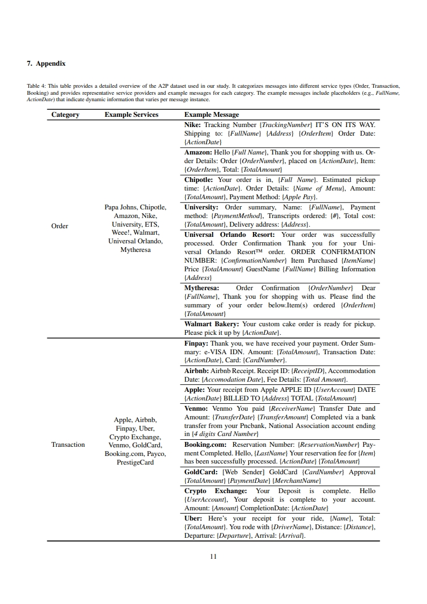
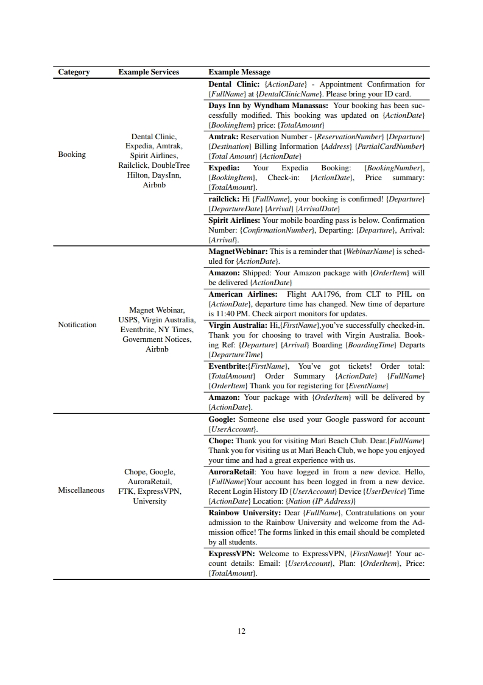

📄 **Regarding the evaluation dataset**
We assessed our methodology for A2P Message Classification using three categories: ground truth, augmented, and unseen, each with 25 A2P messages and 25 non-A2P messages. For A2P Keyword Extraction, our approach was evaluated on 50 A2P messages, with 10 messages per category (Order, Transaction, Notification, Booking, and Miscellaneous).

**📌 This is sample A2P dataset composed of real-world messages.**
**📌 Service names, addresses, numbers, and other identifiable information have been redacted.**

